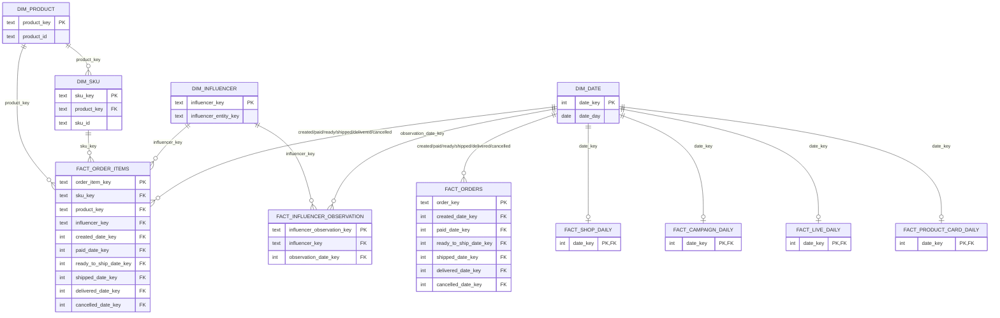

# Warehouse Logical ERD

## Purpose

This document presents the logical dimensional relationships implemented by the
dbt marts layer. It is a portfolio and engineering reference for the current
PostgreSQL warehouse; it does not add a new database or change the closed runtime
architecture.

The relationships below are backed by tests in
`dbt/models/marts/_marts__models.yml`. They are logical warehouse relationships
validated by dbt, not a claim that every mart table has a physical PostgreSQL
foreign-key constraint.

## Model grain

- `dim_date`: one row per calendar date, with `date_key = 0` reserved as unknown.
- `dim_product`: one current product plus an unknown member.
- `dim_sku`: one current SKU, conformed to Product where resolvable.
- `dim_influencer`: one provisional influencer entity plus an unknown member.
- `fact_orders`: one current order row.
- `fact_order_items`: one current order-SKU line.
- `fact_shop_daily`: one row per metric date.
- `fact_campaign_daily`: one row per metric date.
- `fact_live_daily`: one row per metric date.
- `fact_product_card_daily`: one row per metric date.
- `fact_influencer_observation`: one influencer roster source observation.
## Relationship diagram

GitHub renders this Mermaid ER diagram directly from Markdown.

## Role-playing date dimension

`fact_orders` and `fact_order_items` use the same `dim_date` table for six lifecycle
roles: created, paid, ready-to-ship, shipped, delivered, and cancelled. The ERD
collapses those six parallel relationships into one labeled edge per fact to keep
the diagram readable; the dbt schema file tests each foreign-key column separately.

Daily performance facts use `date_key` as both their row-level unique key and their
relationship to `dim_date`, so each date has at most one row in each daily fact.
## Validation semantics

The marts schema contract currently verifies:

- primary/surrogate keys with `not_null` and `unique` tests;
- conformed Product, SKU, Influencer, and Date relationships with dbt
  `relationships` tests;
- unknown-member routing so unresolved dimensional references remain explicit;
- fact-grain reconciliation and non-negative business-measure checks in the
  project data-quality test suite.

Any future warehouse technology change must preserve these grains and
relationships before it can replace the current PostgreSQL marts implementation.

## Source of truth

- `dbt/models/marts/_marts__models.yml` defines tested dimensional relationships.
- `dbt/models/marts/*.sql` defines the current grains, keys, and measures.
- GitHub supports Mermaid diagrams in Markdown, so this file remains reviewable
  as source and renderable in the public repository without a binary diagram.

## Diagram references

- GitHub Mermaid rendering: https://docs.github.com/en/get-started/writing-on-github/working-with-advanced-formatting/creating-diagrams
- Mermaid ER diagram syntax: https://mermaid.js.org/syntax/entityRelationshipDiagram
